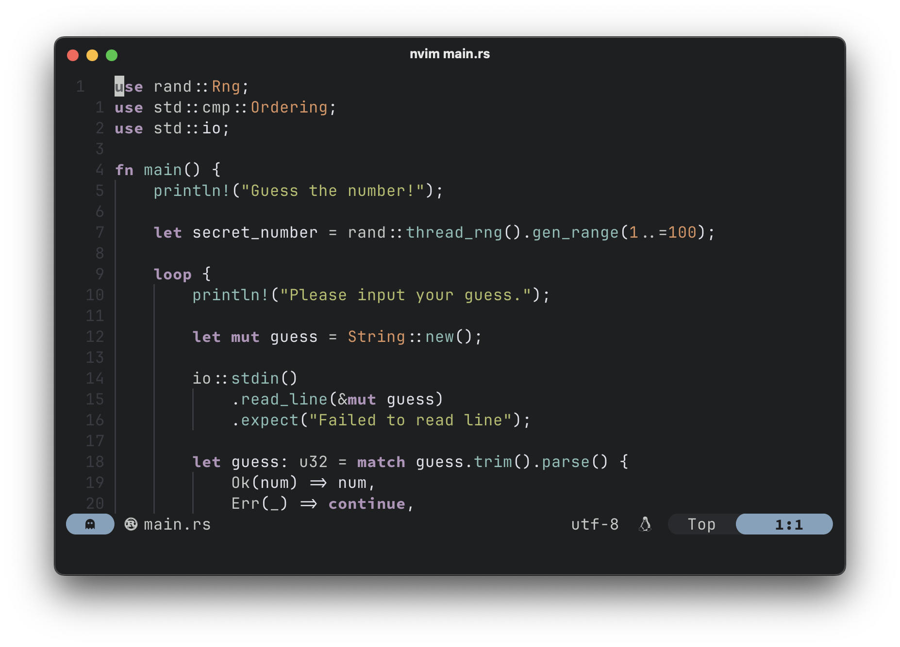

###  Forked from armannikoyan/rusty
# rusty.nvim



## Features

- Supports Treesitter, LSP & Lualine
- Neovim terminal colours

## Installation

Using [lazy.nvim](https://github.com/folke/lazy.nvim):

```lua
"hoangloi07/rusty"
```

Using [packer.nvim](https://github.com/wbthomason/packer.nvim):

```lua
use "hoangloi07/rusty.nvim"
```

## Usage

### lazy.nvim

```lua
return {
	"hoangloi07/rusty",
	lazy = false,
	priority = 1000,
	opts = {
		transparent = true,
		italic_comments = true,
		underline_current_line = true,
		colors = {
			foreground = "#c5c8c6",
			background = "#1d1f21",
			selection = "#373b41",
			line = "#282a2e",
			comment = "#969896",
			red = "#cc6666",
			orange = "#de935f",
			yellow = "#f0c674",
			green = "#b5bd68",
			aqua = "#8abeb7",
			blue = "#81a2be",
			purple = "#b294bb",
			window = "#4d5057",
		},
	},
	config = function(_, opts)
		require("rusty").setup(opts)
		vim.cmd("colorscheme rusty")
	end,
}
```

### packer.nvim

```lua
-- In Lua
vim.cmd([[colorscheme rusty]])

-- Alternatively
require("rusty").setup()
```

## Lualine

```lua
theme = require("rusty").lualine
```
